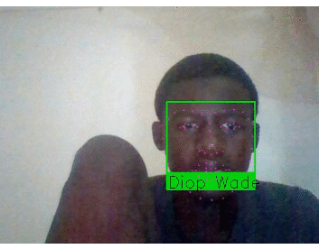

# Reconnaissance faciale

## Avec openCV sur Python

#### Aperçu




## Description du logiciel

Ce logiciel est un logiciel de reconnaissance faciale permettant de détecter le visage d'une personne
dans une vidéo (nous avons utilisé notre webCam). A partir de la base de données de visages embarquées, ce logiciel 
nous donnera le nom de la personne dont le visage est détecté.


## Bibliothèques à installer

Ces bibliothèques ont été installés et embarqués avec le projet :

```
- opencv
- dlib
- numpy
- imutils
- pillow
```

## Important
Vous pouvez mettre à jour le dossier "visage_connus" avec les images des personnes que vous souhaitez détecter 
(assurez-vous de recadrer les visages comme l'exemple de kanoute.png dans le dossier "visage_connus").

Compatibles qu'avec des image .jpg et .png

### Fonctionnalités
```
- Détection de visage
- Reconnaissance faciale
```

## Mode d'emploi
Exécutez l'application avec la commande suivante :

```
> python facial_recog.py --i visages_connus
```
"visages_connus" est le nom du dossier des visages de notre base.
